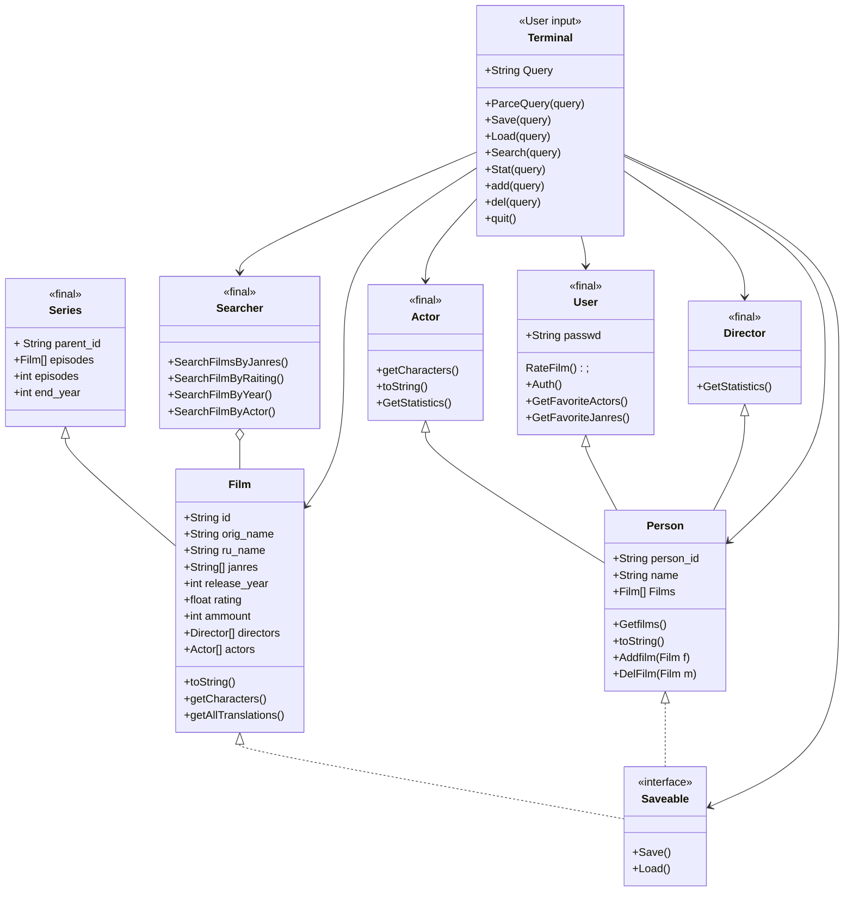

##  Легенда:
"+ — public;"

"- — private;"

"# — protected;"

"~ — package."

```mermaid
classDiagram
    class Terminal{
    <<User input>>
    +String Query
    +ParceQuery(query)
    +Save(query)
    +Load(query)
    +Search(query)
    +Stat(query)
    +add(query)
    +del(query)
    +quit()
    
    }
    
    class Film{
    	+String id
    	+String orig_name
    	+String ru_name
    	+String[] janres
    	+int release_year
    	+float rating
    	+int ammount
    	+Director[] directors
    	+Actor[] actors
    	+toString()
    	+getCharacters()
    	+getAllTranslations()


    }
    class Series {
    <<final>>
    + String parent_id
    +Film[] episodes
    +int episodes
    +int end_year
    
    }
    class Person{
    	+String person_id
    	+String name
    	+Film[] Films
    	+Getfilms()
        +toString()
        +Addfilm(Film f)
        +DelFilm(Film m)
        

    }
    class Actor{
    	<<final>>
    	+getCharacters()
    	+toString()
        +GetStatistics()


    }
    class Director{
    <<final>>
    +GetStatistics()
    }
    
    class User {
    <<final>>
    +String passwd
    RateFilm();
    +Auth()
    +GetFavoriteActors()
    +GetFavoriteJanres()
    
    }
    
    class Saveable {
    <<interface>>
    +Save()
    +Load()
    }
    
    class Searcher{
    <<final>>
    +SearchFilmsByJanres()
    +SearchFilmByRaiting()
    +SearchFilmByYear()
    +SearchFilmByActor()
    }
    
    Actor <|-- Person
    User <|-- Person
    Series <| -- Film
    Director <|-- Person
    Film <|.. Saveable
    Person <|.. Saveable
    Searcher o-- Film
    
    
    Terminal --> Searcher
    Terminal --> Actor
    Terminal --> User
    Terminal --> Saveable
    Terminal --> Director
     Terminal --> Person
      Terminal --> Film
    
    

```
