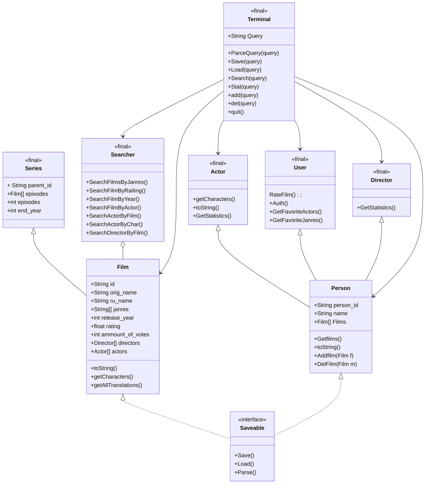

##  Легенда:
"+ — public;"

"- — private;"

"# — protected;"

"~ — package."



---
---
### Аннотация 
Класс **Terminal** является управляющим классом всего проекта, его методы направлены на вызов методов остальных классов, работу с внутренними данными и реализацию работы с пользователем посредством обработки консольно вводимых команд

- Метод ***ParceQuery*** Занимается первоначальной обработкой вводимых пользователем данных, отделяя запрашиваемые действия (**Команды**) от **аргументов** и **ключей** к ним, а затем передает управление, вызывая требуемый метод. Также метод используется внутри любой другой функции класса **Terminal**, т. к. возвращает список переданных аргументов в виде списка вида:
  ```java
  public String[] ParceQuery(String input)
  ["Ключ", "Значение",...];
  ```
 метод ***Save(String query)*** интерфейса **Saveable** содержит три перегруженных варианта.  Класс **Terminal** вызывает нужный, основывясь на запросе переданным в строке *query*, в случае, если строка *query* содержит в себе команду **Save**.
 
  **первый**, не принимает аргументы:
  ```java
  public boolean Save()
  ```
  в таком случае, программа сохраняет все возможные данные классов, реализующих интерфейс **Saveable** в заранее определенные пути, из ~~конфигурационного файла?~~ 
  в противном случае, метод Save принимает в себя классы, реализующие интерфейс **Saveable**, и  путь к файлу, если аргумент пути не указан, то используется стандартный путь из ~~Файла конфигурации?~~
  ```java
  public boolean Save(Saveable data, Path path)
  public boolean Save(Saveable data)
  ```
  Метод возвращает  **True** Если сохранение прошло успешно
  
- Метод ***Load()*** интерфейса **Saveable** реализован также 3 перегрузками с аналогичным методу **Save()** применением, однако обратным эффектом.  Вызывается в случае, если *query* содержит команду **Load**

  ```java
  public boolean Load()
  public boolean Load(Saveable data, Path path)
  public boolean Load(Saveable data)
  ```
-  Метод ***Search()*** в качестве единственного **Обязательного** параметра принимает строку-запрос для поиска
    ```java
    private void Search(String SearchFor)
    ```
    создает экземпляр класса **Searcher**, который реализует дальнейшую логику поиска по объектам и возвращению результата. в основной код. 
    Строкой поиска считается строка, которая идет после команды **Search** в строке *query*
    
- Метод ***Stat()*** выводит статистику запрашиваемого человека, метод принимает в себя объект класса **Person**, для которого в дальнейшем, вызывается метод **GetStatistics()** конкретного класса, дочернего классу **Person** иск. класс **User**
Работа метода основана на том, что все методы класса **Searcher** результатом возвращают
```java
Person[] или Film[]
```
Прототип ф-ии **Stat**():
  ```java
  private void Stat(Person p)
```
Вызов осуществляется при помощи команды **stat**


Применение методов **add()** и **del()** является очевидным, они запускают мастер создания нового объекта любого типа или процесс удаления существующего соответственно т. о.
```java
private void del()

private Series add()
private Film add()
private Actor add()
private User add()
private Director add()

```
Вызов осуществляется при помощи команд **del** и **add**

Метод **quit()** используется для штатного завершения работы программы
```java
private void quit()
```
Вызов: **q**
Класс **Searcher** является поисковиком, который поволяет искать фильмы или людей по нескольким параметрам:
1. Жанр
2. Рейтинг
3. Год
4. Актеры
для фильмов
1. Фильм
2.  Персонаж
 для людей
 Таким образом, прототипы функций класса **Searcher**
 ```java
    public Film[] SearchFilmsByJanres(String query)
    public Film[]SearchFilmByRaiting(String query)
    public Film[]SearchFilmByYear(String query)
    public Film[]SearchFilmByActor(String query)
    public Person[]SearchActorByFilm(String query)
    public Person[]SearchActorByChar(String query)
    public Person[]SearchDirectorByFilm(String query)
```
-  Для класса **Actor** специально определен метод **getCharacters()**, который возвращает, список персонажей актера
 ```java
 public String[] getCharacters()
 public String[] getCharacters(Film film)
```
- Также для класса **Actor** перегружен метод **toString()** с целью удобного вывода информации для пользователя в терминал, при помощи стандратных методов Java

- Для класса **User** был определен метод **RateFilm()**, который предназначен для постановки оценки фильму пользователем по факту просмотра
 ```java
 public void RateFilm(Film film)
```
- Метод **Auth()** Используется для авторизации по логину/паролю вводимому с терминала

```java
public boolean Auth()
```
- Методы **GetFavoriteActors()** И **GetFavoriteJanres()** Нужны для определения любимых актеров и жанров пользователя, основываясь на списке просмотренных им фильмов
```java
public Actor[] GetFavoriteActors()
public String[] GetFavoriteJanres()
```

Пара классов **Film** и **Series** содержит множество разнообразных полей, так:

Для **Series**:

| Поле             	| Значение                                                  	|
|------------------	|-----------------------------------------------------------	|
| String parent_id 	| Id объекта класса фильм, который ассоциируется с сериалом 	|
| Film[] episodes  	| Список эпизодов сериала                                   	|
| int episodes     	| Кол-во эпизодов                                           	|
| int end_year     	| год конца, -1, если нет                                   	|

Для класса **Film**:

| Поле                 	| Значение                    	|
|----------------------	|-----------------------------	|
| String id            	| Id объекта                  	|
| String orig_name     	| Оригинальное название       	|
| String ru_name       	| Русское название, если есть 	|
| String[] janres      	| Массив жанров               	|
| int release_year     	| Год выхода                  	|
| float rating         	| Рейтинг фильма              	|
| кол-во голосов       	| int ammount_of_votes        	|
| Director[] directors 	| массив режесеров            	|
| Actor[] actors       	| массив актеров              	|

В силу того, что **Series** наследует **Film** Методы определенные для **Film** актуальны и для детей

Для **Film** определен метод **toString()**, который нужен для корректного вывода информации в терминал.
Метод **getCharacters()** нужен для получения списка персонажей, учавствующих в фильме
```java
public String[] getCharacters()
```

Так как в базах данных один и тот же фильм может быть представлен в нескольких вариантах, был определен метод: **getAllTranslations()**, который возвращает все переводы фильма
```java
public String[] getAllTranslations()
```

Класс **Person** является родителем для **User**, **Actor**,**Director**, а значит, все поля и методы у этих классов общие.

| Поле             	| Значение       	|
|------------------	|----------------	|
| String person_id 	| Id объекта     	|
| String name      	| Имя            	|
| Film[] Films     	| Список фильмов 	|

Для класса **Person** определены методы:
**Getfilms()**, который используется для получения списка фильмов у каждого актера, режесера или пользователя
```java
public Film[] Getfilms()
```

 Применение метода **toString()** очевидно.
 
 Методы **Addfilm()** и **Delfilm()** нужны для добавления фильма в массив *Films* любого экземпляра **Person** или его детей.

```java
public void Addfilm(Film f)
public void DelFilm(Film m)
```
Метод **Parse()** интерфейса **Saveable** используется для того, чтобы разобрать файлы и созздать экземпляры
```java
public void Parse(Path FilmsFile, Path ActorsFile)
public void Parse()
```
второй вариант использования, функции использует пути к файлам из ~~Файла конфигурации? ~~
