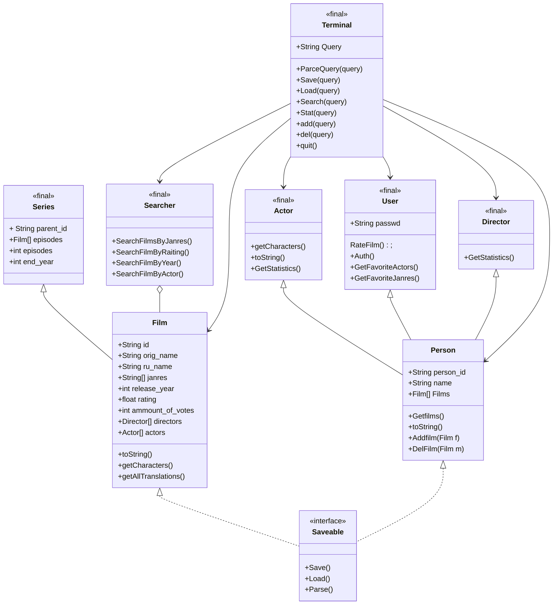

##  Легенда:
"+ — public;"

"- — private;"

"# — protected;"

"~ — package."



---
---
### Аннотация 
Класс **Terminal** является управляющим классом всего проекта, его методы направлены на вызов методов остальных классов, работу с внутренними данными и реализацию работы с пользователем посредством обработки консольно вводимых команд

- Метод ***ParceQuery*** Занимается первоначальной обработкой вводимых пользователем данных, отделяя запрашиваемые действия (**Команды**) от **аргументов** и **ключей** к ним, а затем передает управление, вызывая требуемый метод. Также метод используется внутри любой другой функции класса **Terminal**, т. к. возвращает список переданных аргументов в виде списка вида:
  ```java
  private String[] ParceQuery(String input)
  ["Ключ", "Значение",...];
  ```
 метод ***Save(String query)*** интерфейса **Saveable** содержит три перегруженных варианта.  Класс **Terminal** вызывает нужный, основывясь на запросе переданным в строке *query*, в случае, если строка *query* содержит в себе команду **Save**.
 
  **первый**, не принимает аргументы:
  ```java
  public boolean Save()
  ```
  в таком случае, программа сохраняет все возможные данные классов, реализующих интерфейс **Saveable** в заранее определенные пути, из ~~конфигурационного файла?~~ 
  в противном случае, метод Save принимает в себя классы, реализующие интерфейс **Saveable**, и  путь к файлу, если аргумент пути не указан, то используется стандартный путь из ~~Файла конфигурации?~~
  ```java
  public boolean Save(Saveable data, Path path)
  public boolean Save(Saveable data)
  ```
  Метод возвращает  **True** Если сохранение прошло успешно
  
- Метод ***Load()*** интерфейса **Saveable** реализован также 3 перегрузками с аналогичным методу **Save()** применением, однако обратным эффектом.  Вызывается в случае, если *query* содержит команду **Load**

  ```java
  public boolean Load()
  public boolean Load(Saveable data, Path path)
  public boolean Load(Saveable data)
  ```
-  Метод ***Search()*** в качестве единственного **Обязательного** параметра принимает строку-запрос для поиска
    ```java
    private void Search(String SearchFor)
    ```
    создает экземпляр класса **Searcher**, который реализует дальнейшую логику поиска по объектам и возвращению результата. в основной код. 
    Строкой поиска считается строка, которая идет после команды **Search** в строке *query*
    
- Метод ***Stat()*** выводит статистику запрашиваемого человека, метод принимает в себя объект класса **Person**, для которого в дальнейшем, вызывается метод **GetStatistics()** конкретного класса, дочернего классу **Person** иск. класс **User**
Работа метода основана на том, что все методы класса **Searcher** результатом возвращают
```java
Person[] или Film[]
```
Прототип ф-ии **Stat**():
  ```java
  private void Stat(Person p)
```
Вызов осуществляется при помози команды **stat**


Применение методов **add()** и **del()** является очевидным, они запускают мастер создания нового объекта любого типа или процесс удаления существующего соответственно т. о.
```java
private void del()

private Series add()
private Film add()
private Actor add()
private User add()
private Director add()

```

Метод **quit()** используется для штатного завершения работы программы
```java
private void quit()
```
