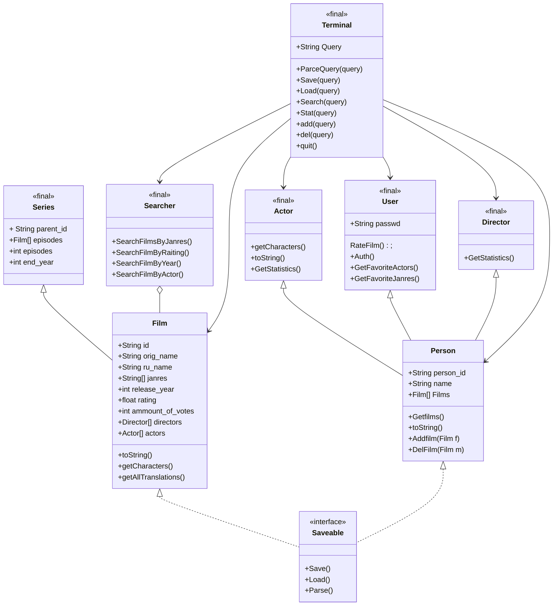

##  Легенда:
"+ — public;"

"- — private;"

"# — protected;"

"~ — package."



---
---
## Аннотация 
Класс **Terminal** является управляющим классом всего проекта, его методы направлены на вызов методов всеи х остальных классов, работу с внутренними данными и реализацию работы с пользователем посредством обработки консольно вводимых команд

- метод *** ParceQuery *** Занимается первоначальной обработкой вводимых пользователем данных, отделяя запрашиваемые действия(**Команды**) от **аргументов** и **Ключей** к ним, а затем передает управление, вызывая требуемый метод, также метод вызывается внутри любой другой функции класса **Terminal**, т. к. возвращает список переданных аргументов в виде списка вида:
  ```java
  private String[] ParceQuery(String input)
  ["Ключ", "Значение",...];
  ```
- метод ***Save(String query)*** содержит три перегруженных варианта, и вызывает нужный метод интерфейса **Saveable**, основывясь на запросе переданным в строке *query*
- 
  **первый**, не принимает аргументы
  ```java
  private boolean Save()
  ```
  в таком случае, программа сохраняет все возможные данные классов, реализующих интерфейс **Saveable** в заранее определенные пути, из ~~конфигурационного файла?~~ 
  в противном случае, метод Save принимает в себя классы реази
  зующие интерфейс **Saveable** и  путь к файлу, если аргумент пути не указан, то использовать стандартный путь из ~~Файла конфигурации?~~
  ```java
  private boolean Save(Saveable data, Path path)
  private boolean Save(Saveable data)
  ```
  Метод возвращает  **True** Если сохранение прошло успешно
  
- Метод ***Load()*** интерфейса **Saveable** реализован также 3 перегрузками с аналогичным методу ** Save()** применением, однако обратным эффектом.

  ```java
  private boolean Load()
  private boolean Load(Saveable data, Path path)
  private boolean Load(Saveable data)
  ```
-  Метод ***Search()*** в качестве единственного ** Обязательного** параметра принимает строку запрос для поиска
    ```java
    void Search(String SearchFor)
    ```
    создает экземпляр класса **Searcher**, который реализует дальнейшую логику поиска по объектам.
    
- Метод ***Stat()*** выводит статистику запрашиваемого человека, метод принимает в себя объект класса **Person**, для которого в дальнейшем, вызывается метод ** GetStatistics()** конкретного класса, дочернего классу **Person** иск. класс **User**

